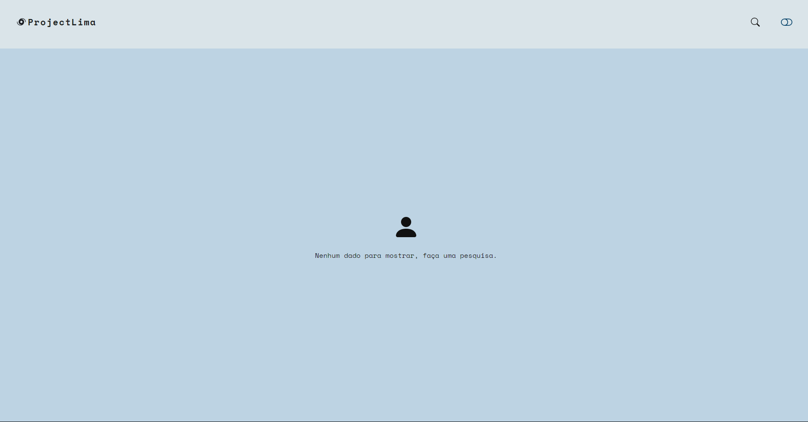
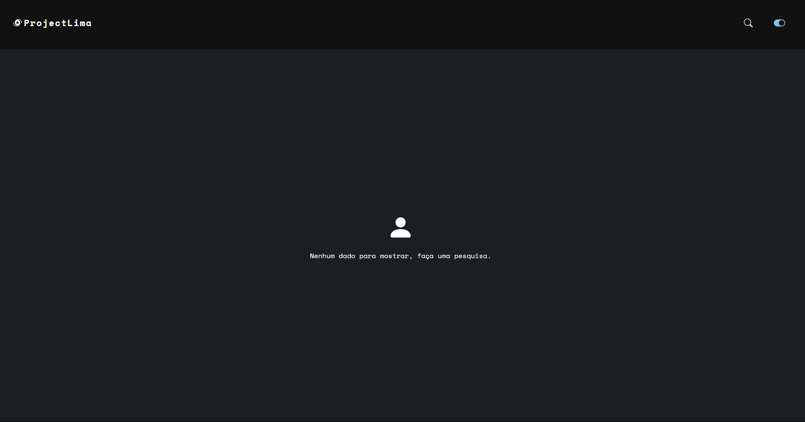
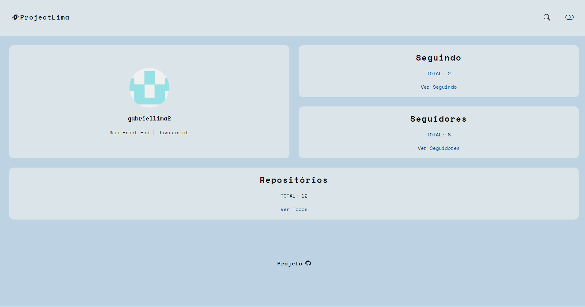
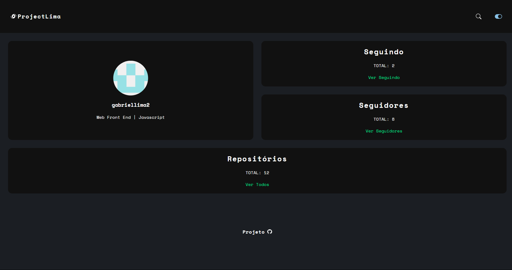
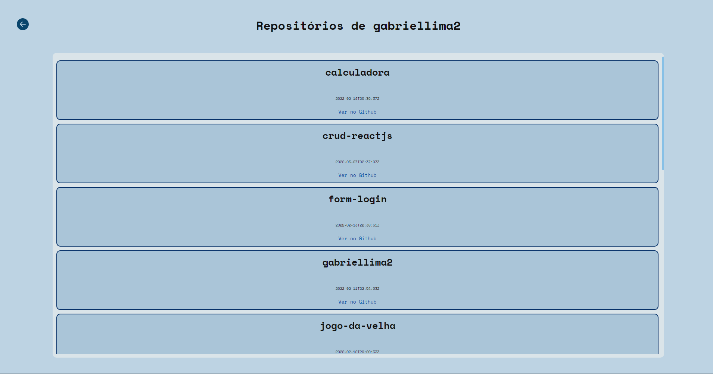
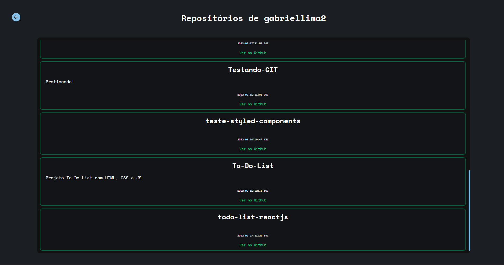

<h1>Search Github Profile-ReactJS</h1>

<p>Esse projeto é um buscador de perfil do Github. Utliza a API do Github, que disponibliza informações públicas em formato JSON, para consumir e mostrar informações de forma resumida.</p>

<h2>Foi criado para estudos: </h2>

<p>Estava precisando fazer um projeto colocando em prática assuntos que no momento estou aprendendo como, estilização com CSS-IN-JS, ReactJS, consumo de API com ReactJS, Rotas. Como esses eram os principais objetivos, acho que deu para cumprir.😆</p>

<h2>Bibiliotecas e Tecnologias utilizadas: </h2>

- [Vite](https://vitejs.dev).
- [ReactJS](https://pt-br.reactjs.org).
- [Styled-Components](https://styled-components.com).
- [React-Icons](https://react-icons.github.io/react-icons).
- [Github-API](https://docs.github.com/pt/rest).
- [React-Router-Dom](https://v5.reactrouter.com/web/guides/quick-start).

<h2>Funcionalidades: </h2>

- Temas Dark e Light.
- Resumo do perfil buscado, total de repos, seguidores, seguindo.
- Rotas para mostrar cada uma das informações acima.
- Link para ver no Github.
- Responsivo.
- Botão de voltar para a rota Home.

<h2>Algumas imagens: </h2>

<div>
    
    
<div>

<h2></h2>

<div>
    
    
<div>

<h2></h2>

<div>
    
    
<div>

<h2>Rodando o projeto: </h2>

<p>OBS: É necessário que tenha o [NodeJS](https://nodejs.org/en/) e o [Git](https://git-scm.com) instalados em sua máquina!</p>

```bash 
1. Clone o repositório:
$ git clone https://github.com/gabriellima2/search-github-profile.git

2. Acesse a pasta e instale as dependências via terminal:
$ npm install

3. Inicie a aplicação em modo de desenvolvimento:
$ npm run dev

4. O servidor será aberto em http://localhost:3000
```
